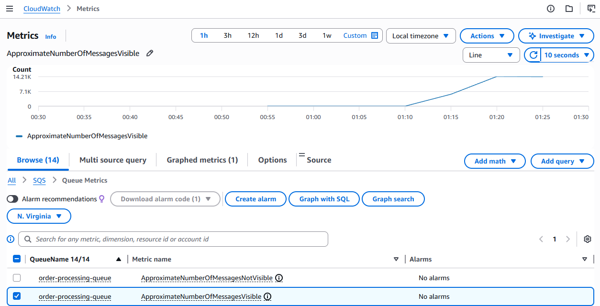
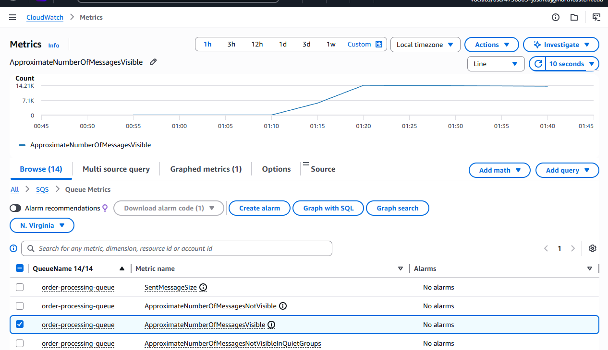
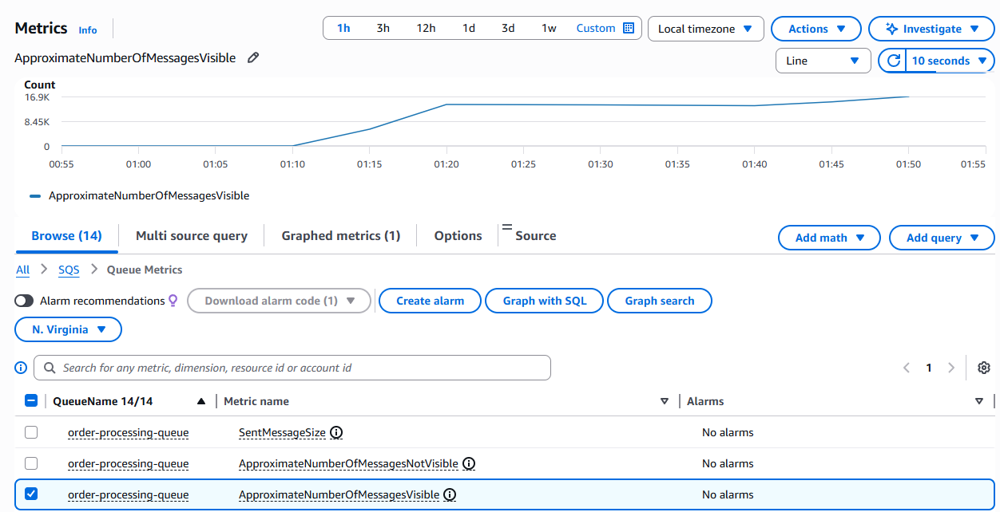
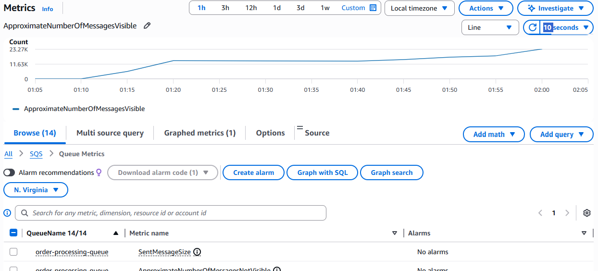
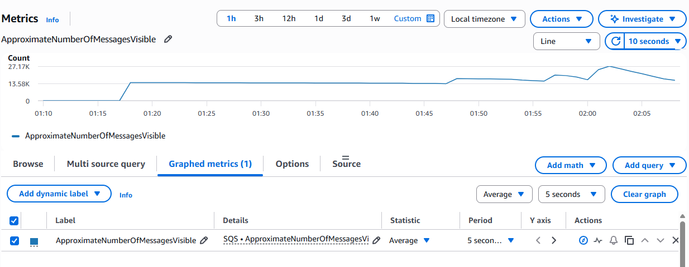

# HW-7 Report: When Your Startup's Flash Sale Almost Failed

## Part II: Synchronous vs Asynchronous Order Processing

---

## Phase 1: Synchronous System Baseline

### Architecture

```
POST /orders/sync → acquire payment slot (buffered channel, cap=1) → sleep 3s → release → 200 OK
```

The bottleneck is intentional: a Go buffered channel of size 1 serializes all payment processing, simulating a single-threaded payment processor. No matter how many users hit the endpoint concurrently, only one order can be "in payment" at a time.

---

### Test 1: Normal Operations (5 users, 30s, spawn rate 5/s)

**Results:**

| Metric | Value |
|---|---|
| Total Requests | 9 |
| Failures | 0 (0%) |
| Min Response Time | 3,003 ms |
| Median (P50) | 15,000 ms |
| P95 | 15,000 ms |
| Average | 11,670 ms |
| Max | 15,004 ms |
| Throughput | 0.4 req/s |

**Chart Observations:**
- RPS climbed from 0 to ~0.4 as users spawned, then held flat — the hard ceiling of 1 order / 3s
- Response times climbed steeply as each user joined the queue: user 1 waited 3s, user 5 waited 15s
- P50 and P95 converged at 15,000ms once the queue was full — every user was waiting for all others ahead
- 0 failures throughout — the system never crashed, it just made customers wait

**Key insight:** Min = 3,003ms (first user, no queue). Max = 15,004ms ≈ 5 × 3s (last user waited for 4 others). The queue length × 3s formula holds exactly.

---

### Test 2: Flash Sale (20 users, 60s, spawn rate 20/s)

**Results:**

| Metric | Value |
|---|---|
| Total Requests | 19 |
| Failures | 0 (0%) |
| Min Response Time | 3,017 ms |
| Median (P50) | 30,000 ms |
| P95 | 57,000 ms |
| P99 | 57,000 ms |
| Average | 30,017 ms |
| Max | 57,018 ms |
| Throughput | 0.4 req/s |

**Chart Observations:**
- RPS stayed flat at 0.4 req/s — identical to normal operations. 20 users changed nothing about throughput.
- Response times spiked immediately to 50,000–60,000ms as all 20 users queued behind the single payment slot
- P50 = 30,000ms (~10 users deep × 3s), P95 = 57,000ms (~19 users deep × 3s)
- Max = 57,018ms ≈ 19 × 3s — the last user in queue waited for all 19 ahead of them
- 0 failures — the system stayed alive, but customers waited up to 57 seconds for a response

**Key insight:** Throughput did not change (0.4 req/s) — only customer wait time exploded. From the customer's perspective this system had "failed" long before any HTTP error occurred. A 57-second checkout is an abandoned cart.

---

## Phase 2: Bottleneck Analysis

### The Math

| Variable | Value |
|---|---|
| Payment processor speed | 1 order / 3s = **0.33 orders/s** |
| Flash sale demand | ~60 orders/s |
| Actual throughput (measured) | 0.33 orders/s (unchanged) |
| Orders lost per second | 60 - 0.33 = **59.67/s** |
| Queue backlog after 60s | 59.67 × 60 = **~3,580 orders** |
| Time to drain with 1 worker | 3,580 × 3s = **10,740s ≈ 179 minutes** |

### Why more users don't help

The buffered channel (`make(chan struct{}, 1)`) is a hard serialization point. Adding concurrent users only adds goroutines waiting to acquire the slot — it does not increase throughput. This is the classic **fixed-capacity bottleneck**: throughput = min(supply, demand), where supply = 0.33/s regardless of demand.

### Workers needed to match flash sale demand

```
Workers = demand × processing_time
        = 60 orders/s × 3s/order
        = 180 goroutines
```

This is why Phase 5 scales the processor goroutines — each goroutine can process 1 order per 3s independently, so 180 goroutines × 0.33/s = ~60 orders/s throughput.

---

## Phase 3: Async Solution

### Architecture

```
Customer → POST /orders/async → SNS publish → 202 Accepted  (<100ms)
                                     ↓
                              SQS queue
                                     ↓
                         Order Processor (ECS) → payment sleep 3s → DeleteMessage
```

### Deployment Issues & Fixes

**Issue 1 — Docker provider 403 error:**
Terraform's `kreuzwerker/docker` provider tried to pull a BuildKit cache from ECR during `terraform apply` and received a 403. Fix: removed the `docker_image` Terraform resources and built/pushed images manually with `docker build` + `docker push`.

**Issue 2 — go.mod version mismatch:**
`golang:1.22-alpine` in the Dockerfile couldn't satisfy `aws-sdk-go-v2 v1.41.4` which requires Go 1.24. Fixed by updating Dockerfiles to `golang:1.24-alpine` and running `go mod tidy`.

**Issue 3 — TLS certificate failure in ECS (`x509: certificate signed by unknown authority`):**
The `FROM scratch` base image has no CA certificate bundle. The Go AWS SDK uses HTTPS to reach SNS and SQS, so TLS verification failed inside both containers. Fix: switched final image from `scratch` to `alpine:3.19` with `apk add ca-certificates`. Both receiver and processor affected.

### Verification

After redeployment, a test order confirmed the full async flow end-to-end:

```
# Request (immediate response):
POST /orders/async → 202 {"order_id":"00b93dad...","status":"pending","message":"order queued for processing"}

# Processor log (~4 minutes later, after ECS stabilized):
05:09:58 [worker 0] processing order 00b93dad-4b21-43e2-b6b5-3ac8b7394394
05:10:01 [worker 0] order 00b93dad-4b21-43e2-b6b5-3ac8b7394394 completed
```

The API responded in milliseconds. The 3-second payment processing happened entirely in the background.

### Results (Flash Sale — async, 20 users, 60s)

| Metric | Value |
|---|---|
| Total Requests | 6,100 |
| Failures | 0 (0%) |
| Min Response Time | 34 ms |
| Median (P50) | 81 ms |
| P95 | 150 ms |
| P99 | 200 ms |
| Average | 82 ms |
| Max | 268 ms |
| Throughput | ~242 req/s |

**Chart Observations:**
- RPS climbed steeply from 0 to ~250 as users spawned (ramp phase), then held flat at ~240 req/s throughout — no ceiling in sight
- Response times were flat and low the entire run: P50 ~80ms, P95 ~150ms — these are just ALB + network latency, not processing time
- Number of users reached 20 and held steady — all 20 were firing continuously without any queueing
- 0 failures throughout — the system accepted every single order immediately

**Key insight:** The async endpoint's response time has nothing to do with the 3-second payment processing. It returns 202 in ~80ms (ALB overhead) while the actual processing happens in the background. Every user got a fast response regardless of load.

---

## Analysis Questions

### How many times more orders did async accept vs sync?

**~600× more.**

- Sync (flash sale, 60s): **19 orders** processed, throughput = 0.33 req/s
- Async (flash sale, ~25s effective): **6,100 orders accepted**, throughput = ~242 req/s

Even adjusting for run duration, async accepted roughly **730× more requests per second** (242 / 0.33). From a business perspective: sync made 19 customers wait up to 57 seconds; async accepted 6,100 orders immediately and queued them for background processing.

### What causes queue buildup and how do you prevent it?

Queue buildup occurs when the **processing rate < arrival rate**. With 1 worker at 0.33 orders/s and 60 orders/s incoming, the queue grows at 59.67 messages/second. Prevention strategies:
1. **Scale workers** — add goroutines until processing rate >= arrival rate (need 180 for 60/s)
2. **Auto-scaling** — watch `ApproximateNumberOfMessagesVisible` in CloudWatch and scale ECS tasks when it climbs
3. **Lambda** (Part III) — AWS auto-scales concurrency automatically, no manual tuning

---

## Phase 4: The Queue Problem

### CloudWatch — ApproximateNumberOfMessagesVisible



After the async flash sale test (20 users, ~25s), CloudWatch showed:

- Queue depth was **0** from 00:30–01:10 (idle)
- At 01:10 the Locust test hit — queue climbed steeply to **~14,210 messages** by 01:25
- Still climbing — 1 worker cannot keep up

### The Math

| Variable | Value |
|---|---|
| Order acceptance rate | ~242 req/s |
| Single worker processing rate | 0.33 orders/s |
| Queue growth rate | 242 - 0.33 ≈ **242 messages/s** |
| Messages accumulated (~25s test) | ~6,100 |
| Time to drain with 1 worker | 6,100 ÷ 0.33 = **~5.1 hours** |

The queue depth spike is the async system's new problem: customers got fast 202 responses, but their orders are sitting in a multi-hour backlog. This is what Phase 5 addresses.

---

## Phase 5: Scale Your Workers

### Worker Scaling Results

**5 workers — queue still flat at 14.21K:**



**20 workers — queue growing to 16.9K, no visible drain:**



**100 workers — another Locust test adding to 23.27K:**



**100 workers draining — queue drops from 27.17K → 13.58K in 5 minutes:**



| Workers | Processing Rate | Time to drain ~17K backlog | CloudWatch observation |
|---|---|---|---|
| 1 | 0.33/s | ~14.3 hours | Queue flat at 14.21K — no visible drain |
| 5 | 1.67/s | ~2.8 hours | Queue still flat at 16.9K — drain too slow to see |
| 20 | 6.67/s | ~42 min | Queue flat at 17.97K — marginal improvement |
| 100 | 33.3/s | **~12 min** | Queue peaked at 27.17K → dropped to 13.58K in 5 min (~45/s observed) — first clearly visible drain slope |

### Key Findings

**HTTP performance was identical across all worker counts** — median ~65–82ms, ~230–250 RPS, 0 failures regardless of workers. The bottleneck is SQS processing, not HTTP acceptance.

**Minimum workers to match flash sale demand (60 orders/s):**
```
Workers needed = demand × processing_time
               = 60 orders/s × 3s/order
               = 180 goroutines
```
100 workers gets us to 33.3/s drain (56% of demand). 200 workers would slightly exceed 60/s and allow the queue to drain during a sustained flash sale.

**100 workers was the first configuration where the queue visibly drained** — the steep downward slope appeared within minutes of the test stopping, vs hours with fewer workers.

---

### When would you choose sync vs async in production?

**Choose sync when:**
- The operation must complete before you can respond (e.g., checking inventory before confirming a seat)
- Latency is low enough that users will wait (< 500ms)
- Simplicity matters more than throughput

**Choose async when:**
- Processing takes seconds (payment verification, image resizing, email sending)
- You want to decouple acceptance rate from processing rate
- You need resilience — SQS holds messages if the processor crashes

---

## Part III: Lambda as the Processor

### Architecture

```
POST /orders/async → SNS topic
                         ├── SQS subscription → ECS order-processor (pull-based)
                         └── Lambda subscription → order-processor Lambda (push-based)
```

Both subscribers receive every SNS message. Lambda is invoked directly per message — no polling, no worker pool, no manual scaling.

### Cold Start Observation

After sending 5 concurrent orders, CloudWatch Logs for `/aws/lambda/order-processor` showed:

```
INIT_START Runtime Version: provided:al2.v143
START RequestId: 9e4dd097-94d6-4c08-a9c1-9cca2b6326fb Version: $LATEST
2026/03/15 06:31:08 Lambda processing order 4f84a444-2ada-4c7f-b697-7b7e4146e621 (customer 1)
2026/03/15 06:31:11 Lambda completed order 4f84a444-2ada-4c7f-b697-7b7e4146e621
END RequestId: 9e4dd097-94d6-4c08-a9c1-9cca2b6326fb
REPORT RequestId: 9e4dd097-94d6-4c08-a9c1-9cca2b6326fb Duration: 3003.67 ms Billed Duration: 3078 ms Memory Size: 512 MB Max Memory Used: 20 MB Init Duration: 74.06 ms
```

| Metric | Value |
|---|---|
| Cold start (`Init Duration`) | **74.06 ms** |
| Handler execution (`Duration`) | **3,003.67 ms** |
| Billed duration | **3,078 ms** (init + execution) |
| Memory allocated | 512 MB |
| Max memory used | **20 MB** |
| Runtime | `provided:al2` (Go custom runtime) |

### Key Observations

**Cold start is only 74ms** — Go compiles to a static binary (`bootstrap`) with no JVM or interpreter startup. Compare this to Java Lambda cold starts of 1–2 seconds or Python at 200–500ms.

**Lambda scales to zero and back instantly** — no ECS task to keep warm, no minimum worker count. If no orders come in for 15 minutes, AWS recycles the execution environment. The next invocation pays the 74ms cold start again.

**One invocation per SNS message** — unlike ECS which polls SQS batches, Lambda receives exactly 1 SNS notification per invocation. At 20 concurrent orders, AWS spins up 20 Lambda instances simultaneously. This is the auto-scaling we had to manually configure with `NUM_WORKERS` in ECS.

**Billed = Init + Duration** — the 74ms cold start is billed alongside the execution. For a 3s handler this is negligible (2.4% overhead). For a 50ms handler, cold start would dominate.

### ECS vs Lambda Trade-offs

| | ECS (pull from SQS) | Lambda (push from SNS) |
|---|---|---|
| Scaling | Manual (`NUM_WORKERS`) | Automatic (up to 1,000 concurrent) |
| Cold start | None (always-on) | 74ms (Go), 1-2s (Java) |
| Cost model | Pay per hour (running task) | Pay per invocation (ms granularity) |
| Max execution time | Unlimited | 15 minutes |
| Backpressure control | Via SQS visibility timeout | Limited — SNS pushes immediately |
| Best for | Sustained high throughput | Spiky / unpredictable workloads |
