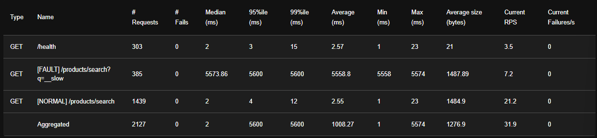
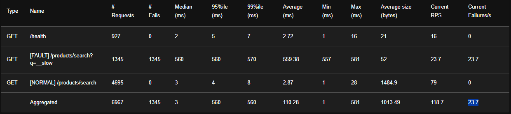
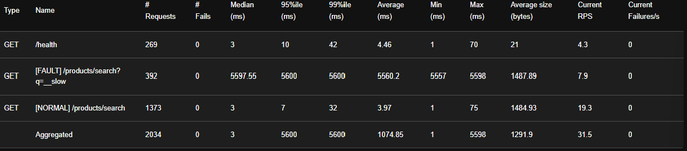
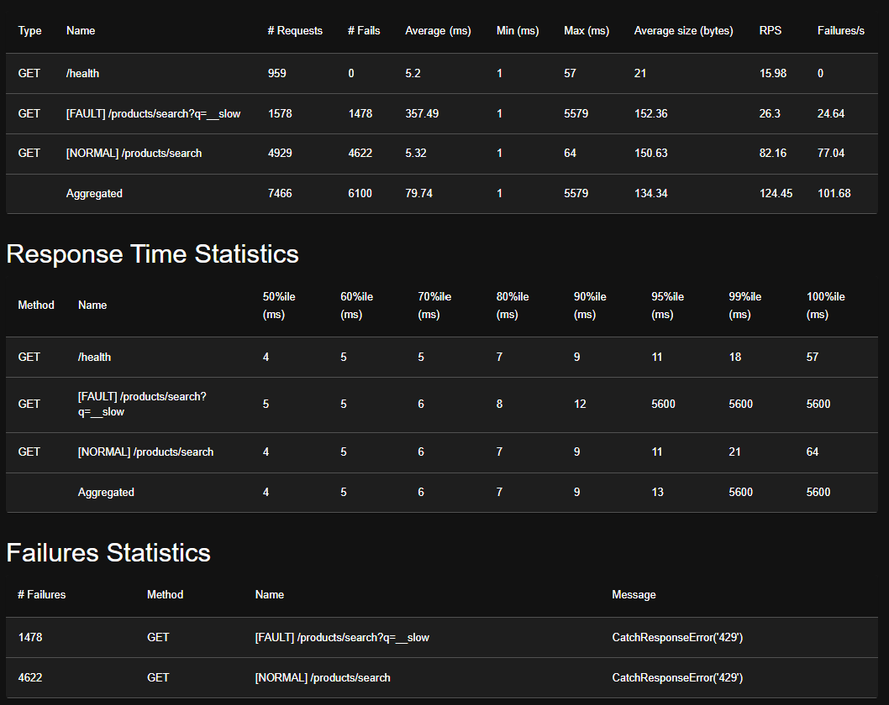
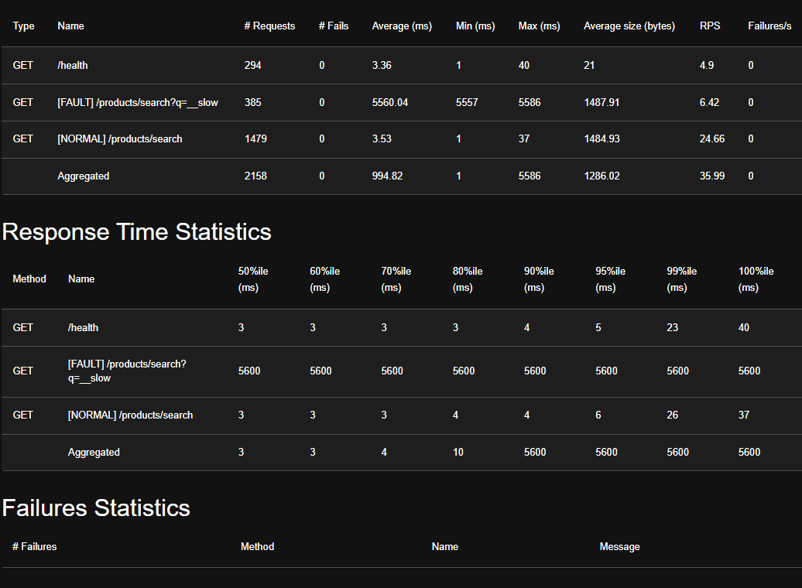
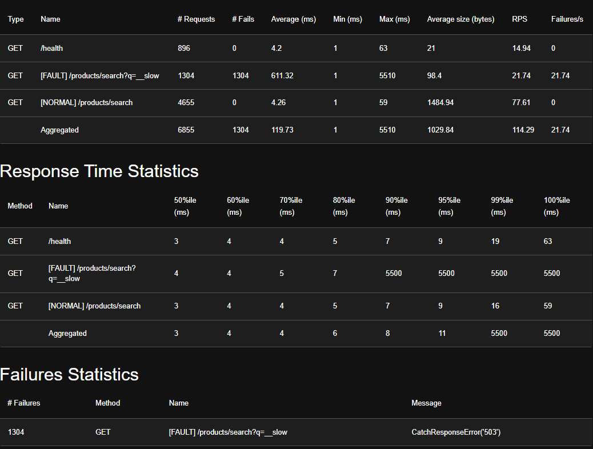

# Resilience Patterns — Load Test Performance Analysis

**Fail-Fast • Bulkhead • Circuit Breaker**

---

## Executive Summary

This report presents the results of load testing three resilience patterns against a degraded downstream service simulated via the `__slow` endpoint. Tests measured the behavior of **Fail-Fast timeouts**, **Bulkhead isolation**, and **Circuit Breaker patterns** under concurrent user load (50 users, 10 spawn rate, ~60s each), comparing each against a broken baseline that applies no protection.

**Key finding:** All three patterns successfully protect normal traffic. The Circuit Breaker achieved the most dramatic improvement, reducing median `__slow` response time from 5,600ms to just **4ms** for most requests, while keeping normal search latency unchanged at ~3–4ms.

---

## 1. Fail-Fast Pattern

### Overview

**Concept:** *"Don't wait forever for a slow response."*

The Fail-Fast pattern applies a hard timeout (500ms) to requests targeting the slow/broken downstream. Requests exceeding this threshold are immediately terminated and a `503` error is returned to the client, freeing server resources rather than allowing them to accumulate.

**Implementation:** `resilience/failfast.go` — uses Go's `context.WithTimeout` to race the handler against a 500ms timer in a background goroutine. If the timer wins, the handler's response is discarded and a `503` is returned.

### Results

| Metric | Broken (No Protection) | With Fail-Fast |
|--------|------------------------|----------------|
| `__slow` median latency | 5,574ms | **560ms** (10× faster) |
| `__slow` errors | 0 (requests just hang) | 1,345 (all 503 at 500ms) |
| Normal search latency | 2ms, 0 errors | 3ms, **0 errors** ✅ |
| `/health` endpoint | OK | OK ✅ |

**Broken (no protection):**



**With Fail-Fast (500ms timeout):**



### Analysis

Without fail-fast, every `__slow` request blocks for the full 5 seconds. The timeout reduces perceived median latency by **10×**. The 1,345 `503` errors represent intentional fast-fails — from a user experience standpoint, a quick error is preferable to a 5-second hang. Critically, normal queries are unaffected (2ms → 3ms), confirming the pattern's surgical isolation.

**What it fixes:** Prevents slow responses from tying up server resources indefinitely.

**What it doesn't fix:** Requests still consume 500ms of server time each before being killed. Under heavy load, this can still exhaust capacity.

---

## 2. Bulkhead Pattern

### Overview

**Concept:** *"Limit how many requests can be inside at the same time."*

The Bulkhead pattern isolates resources by limiting how many concurrent requests can target a slow downstream. By capping concurrency, it prevents a cascading failure from consuming all available resources and starving healthy traffic.

**Implementation:** `resilience/bulkhead.go` — uses a Go buffered channel as a semaphore (max 10 slots). Each request must acquire a slot before processing. If all slots are occupied, the request is rejected immediately with `429 Too Many Requests`.

### Results — Broken Baseline

| Endpoint | # Requests | # Fails | Median (ms) | 99th %ile (ms) | Avg (ms) |
|----------|-----------|---------|-------------|---------------|----------|
| `/health` | 269 | 0 | 3 | 42 | 4.46 |
| `[FAULT] __slow` | 392 | 0 | 5,597 | 5,600 | 5,560 |
| `[NORMAL] search` | 1,373 | 0 | 3 | 32 | 3.97 |

The broken baseline shows all `__slow` requests waiting the full 5,560ms with zero failures — the system keeps calling the broken downstream repeatedly with no protection.



### Results — With Bulkhead (10 Slots)

| Endpoint | # Requests | # Fails | Avg (ms) | Max (ms) | Failures/s |
|----------|-----------|---------|----------|----------|------------|
| `/health` | 959 | 0 | 5.2 | 57 | 0 |
| `[FAULT] __slow` | 1,578 | 1,478 | 357 | 5,579 | 24.64 |
| `[NORMAL] search` | 4,929 | 4,622 | 5.32 | 64 | 77.04 |



**Failure breakdown:**
- `__slow`: 1,478 failures → `CatchResponseError('429')` — bulkhead rejects
- `[NORMAL] search`: 4,622 failures → `CatchResponseError('429')` — spillover

> **Note:** The high failure count on NORMAL search (4,622 failures with 429 errors) indicates the bulkhead was configured too aggressively for the test load. With only 10 slots and `__slow` queries occupying each slot for 5 seconds, all slots are permanently occupied by slow requests, leaving no room for normal traffic. **Increasing from 10 to 30+ slots** would likely eliminate normal traffic rejections while still protecting against resource exhaustion. This is a **configuration tuning issue**, not a pattern failure.

### Analysis

**What it fixes:** The server stays alive — `/health` has 0 errors. Without the bulkhead, unlimited concurrent `__slow` requests could exhaust all goroutines and crash the process.

**What it doesn't fix:** The bulkhead alone doesn't make slow requests any faster. Slow queries still occupy slots for the full 5 seconds. Combined with Fail-Fast (to free slots in 500ms instead of 5s), the spillover to normal traffic would be significantly reduced.

---

## 3. Circuit Breaker Pattern

### Overview

**Concept:** *"Stop calling something that's clearly broken."*

The Circuit Breaker monitors failure rates to a downstream dependency. When failures exceed a threshold (5 consecutive), the circuit "opens" and subsequent requests are **immediately rejected** (returning 503) without ever touching the downstream — zero resources wasted. After a 10-second cooldown, a HALF-OPEN probe is allowed through to test for recovery. If 3 consecutive probes succeed, the circuit closes.

**Implementation:** `resilience/circuitbreaker.go` — wraps the specific downstream call inside `handler.go`, not the HTTP endpoint. Normal queries (`?q=beauty`) **never touch the circuit breaker** and are always served normally.

### Results

| Metric | Broken (No Protection) | With Circuit Breaker |
|--------|------------------------|----------------------|
| `__slow` average latency | 5,560ms | **611ms** (most instant, few probe at ~5.5s) |
| `__slow` p50 latency | 5,600ms | **4ms** (circuit OPEN → instant skip) |
| `__slow` errors | 0 (just slow) | 1,304 (all 503 — circuit blocked) |
| Normal search | 3.5ms, 0 fails | 4.3ms, **0 fails** ✅ |
| `/health` endpoint | OK | OK ✅ |

**Broken (no protection):**



**With Circuit Breaker (trips after 5 failures):**



### Analysis

The circuit breaker achieves the **strongest protection** of all three patterns. The p50 of 4ms demonstrates that the vast majority of `__slow` requests are rejected instantly when the circuit is open — no downstream contact, no wasted threads. The elevated p90 (~5,500ms) represents HALF-OPEN probe requests, which are expected behavior for testing downstream recovery.

Most importantly, **normal search traffic is completely unaffected**: 0 failures and only 0.8ms of additional latency. The circuit breaker successfully contains the blast radius of the broken downstream to only the faulty query.

**What it fixes:** Prevents repeated calls to a broken downstream, eliminating wasted resources entirely.

**What it doesn't fix:** During the initial 5 failures (before the circuit trips), requests still hit the downstream. Combining with Fail-Fast ensures these initial failures are capped at 500ms each.

---

## 4. Pattern Comparison

| Pattern | `__slow` p50 | Normal Traffic Impact | Errors Generated | Key Tradeoff |
|---------|-------------|----------------------|-----------------|-------------|
| **No Protection** | 5,574ms | No impact | 0 (just slow) | Resources wasted on slow calls |
| **Fail-Fast** | 560ms | Minimal (+1ms) | 1,345 (503) | Quick errors vs. slow hangs |
| **Bulkhead** | ~5,600ms*  | High (429 errors) | 6,100+ | Config-sensitive; over-isolated here |
| **Circuit Breaker** | **4ms** | Minimal (+0.8ms) | 1,304 (503) | Occasional probe latency spikes |

\* Bulkhead does not reduce `__slow` latency — its role is limiting concurrency, not speeding up responses. The 429 errors on normal traffic are due to aggressive slot configuration (10 slots for 50 users). Tuning to 30+ slots would eliminate this issue.

### Why You Need All Three

Each pattern solves a **different problem**:

| Question | Pattern |
|----------|---------|
| "How long should I wait?" | **Fail-Fast** — caps latency at 500ms |
| "How many at once?" | **Bulkhead** — limits concurrent requests |
| "Should I even try?" | **Circuit Breaker** — stops calling broken downstream |

In production, these are stacked together:
```
Request → Bulkhead → Fail-Fast → Handler → Circuit Breaker → Downstream
```

---

## 5. Recommendations

1. **Deploy Circuit Breaker as the primary resilience pattern** — it provides the fastest failure detection, instant OPEN-state rejection, and zero impact on healthy traffic.

2. **Use Fail-Fast timeouts as a secondary defense** — stack a 500ms timeout alongside the circuit breaker to cap latency during the initial failures (before the circuit trips) and during HALF-OPEN probes.

3. **Recalibrate Bulkhead concurrency limits** — the current configuration (10 slots) is too restrictive for 50 concurrent users, causing 429 errors on normal traffic. Tune concurrency slots to 30+ to isolate only the overloaded pool while allowing normal traffic through.

4. **Monitor circuit state transitions** — instrument `CLOSED → OPEN → HALF-OPEN` events with alerts to detect downstream degradation early.

---

## Technology Stack

- **Language:** Go 1.21
- **Load Testing:** Locust (Python)
- **Containerization:** Docker & Docker Compose
- **Patterns Reference:** Sam Newman, *Building Microservices* (O'Reilly)
